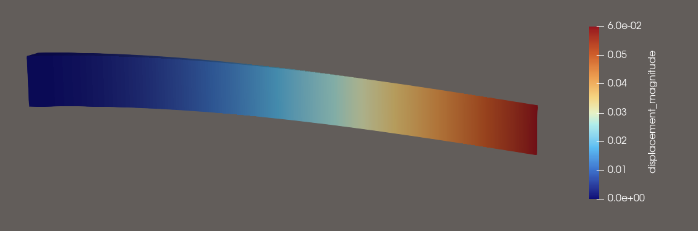
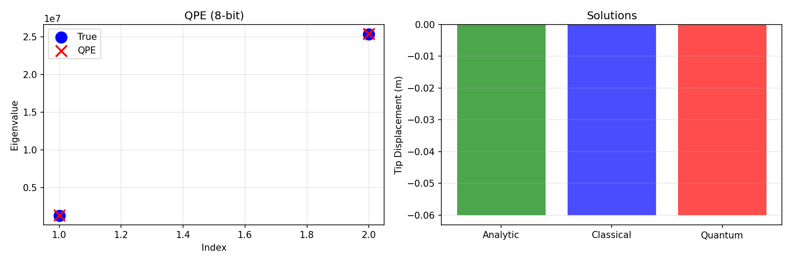

# Quantum FEA for Cantilever Beams

I try to implement a quantum algo for the cantiliver beam problem, by using quantum phase estimation (a very rudimentary attempt) with the HHL algorithm.


*Three-dimensional visualization of cantilever beam deflection rendered in ParaView, showing displacement magnitude from the fixed support (left, blue) to the free end (right, red) under transverse loading.*


This was done as a project for my "ME3421E Introduction to Finite Element Methods" course

## Overview

FEM discretizes mechanics into a stiffness matrix  $\mathbf{K}$, the nodal displacement vector $\mathbf{u}$, and $\mathbf{f}$ the applied load vector. We consider a euler-bernoulli cantilever beam, and Hermite cubic elements are used to ensure $C^1$ continuity. The assembled stiffness matrix is then solved with Cirq to extract eigenvalue information and construct solution states, as we would in the classical solution.


This implementation consists of three modules. The FEA module (`beam.py`) implements Hermite cubics, and applies boundary conditions to obtain the reduced system of equations. The QPE module (`phase_estimation.py`) provides a multi-qubit QPE circuit that extracts eigenvalues of the stiffness matrix through controlled unitary operations and inverse quantum Fourier transform. The HHL solver module (`hhl.py`) runs the complete quantum linear system solver by preparing the initial state, performing eigenvalue-controlled rotations, and recovering the solution through postselection and amplitude extraction.

## Installation 

We use cirq, python and numpy. Run `pip install cirq numpy matplotlib`. Do it in a venv if you prefer

## Running the demo

The demo script is `src/quantum_fem/demo_quantum_fem_complete.py`. Running it without arguments will solve the default cantilever problem (1.0 m length, 0.1 m square cross-section, 10 kN tip load) using both classical finite element methods and the quantum-simulated HHL algorithm, producing comparison plots and VTK output files for 3D visualization.

check the script to see the command line options, `-f` can be used to the force in kN.

### Output

```
$ python src/quantum_fem/demo_quantum_fem_complete.py -f 300

Running: Force=300.0kN, Length=1.0m, Width=0.1m


Classical:
  Analytic: -6.000000e-02 m
  FEM:      -6.000000e-02 m

Running QPE (8-bit)...
[QPE] Auto-selected t=1.652263e-07 (λ_min=1314829.0818, λ_max=25351837.5849)
[QPE] Expected phase range: [0.0346, 0.6667]
  QPE eigenvalues: [1336913.31014015]
  True eigenvalues: [ 1314829.0817867  25351837.58487997]

Running HHL...
  Quantum solution: [-0.06000001 -0.09      ]
  Classical solution: [-0.06 -0.09]
  Error: 0.000007%
  Success probability: 18.6%

Saved results to quantum_fem_demo.png
check *vtk files for final results

  Tip deflection: 60.000 mm

ParaView: Open *_detailed.vtk → Apply → Warp By Vector (scale 100-1000)
```

## Visualization

A comparative plot saved as `quantum_fem_demo.png` displays the classical and quantum-simulated solutios, eigenvalue estimates from the phase estimation routine, and statistical information about the HHL ancilla measurement outcomes. Additionally, four VTKs are produced representing the coarse single-element solution and a refined multi-element discretization for both classical and quantum solution vectors.


*Comparison of quantum phase estimation eigenvalue recovery (left panel) and solution accuracy (right panel). The QPE circuit with 8 precision qubits successfully estimates the two eigenvalues of the reduced stiffness matrix (shown as red X markers overlaying the true values in blue circles). The tip displacement comparison demonstrates agreement between analytical beam theory (green), classical finite element solution (blue), and quantum-simulated HHL solution (red) to within numerical precision on the state-vector simulator.*

VTK files can be opened in ParaView - load the file, click on "apply", then add a "Warp By Vector" filter, you should then see the full visualization

## Theoretical Background and Limitations

note: all quantum computations reported in this implementation are performed using a classical state-vector simulator, which executes the quantum circuit operations with floating-point arithmetic on conventional hardware. The simulator reproduces the ideal mathematical behavior of quantum gates without physical noise, decoherence, or finite sampling effects that would be present on actual quantum devices. Thus, reported solution accuracy reflects algorithmic correctness AND NOT experimental quantum computing performance. so yeah, its kinda "fake", but this project's main goal is to show that it can be done on a quantum computer

## Citation and Acknowledgments

The project was to do a literature review, and compare results with existing methods. We used the following paper for basically everything -

> Zhao, Y., Gao, X., Chen, J., & Peng, X. (2024). *Quantum Finite Element Method for Structural Mechanics*. arXiv preprint arXiv:2403.19512. [https://arxiv.org/abs/2403.19512](https://arxiv.org/abs/2403.19512)
